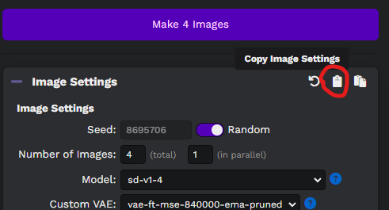

# Stable Diffusion UI: Samplers Generator


## Installation

First you need to download and run [Stable Diffusion UI](https://github.com/cmdr2/stable-diffusion-ui).

Next, make sure you have [Composer](https://getcomposer.org), [PHP 8.1](https://www.php.net) or higher
and [Git](https://git-scm.com/downloads) installed on your computer.

Then download this repository:

```bash
git clone git@github.com:andrey-helldar/stable-diffusion-samplers-generator.git
```

Next, go to the project folder and install the dependencies:

```bash
cd ./stable-diffusion-samplers-generator

composer install
```

## Configuration

The project has few static settings - these are the names of the samplers, the number of steps for generating images and cell size.

Configuration files are located in the [`config`](config) folder.

## Usage

> First you need to run the neural network python script
> See more: https://github.com/cmdr2/stable-diffusion-ui/wiki/How-to-Use

### Sampler generation for all available models

To do this, you need to call the `bin/sampler models` console command, passing it the required parameter `--prompt`.

For example:

```bash
bin/sampler models --prompt "a photograph of an astronaut riding a horse"
```

If you want to generate a sampler table for a previously generated image, then you need to also pass the `--seed` parameter with this value when invoking the console command.

For example:

```bash
bin/sampler models --prompt "a photograph of an astronaut riding a horse" --seed 2699388
```

#### Available options

* `---prompt` - Query string for image generation. It's a string.
* `--negative-prompt` - Exclusion words for query generation. It's a string.
* `--tags` - Image generation modifiers. It's array.
* `--fix-faces` - Enable fix incorrect faces and eyes via GFPGANv1.3. It's a boolean.
* `--path` - Path to save the generated samples. By default, in the `./build` subfolder inside the current directory.
* `--seed` - Seed ID of an early generated image.

### Sampler generation for one model

To do this, you need to call the `bin/sampler model` console command, passing it the required parameters `--prompt` and `--model`.

For example:

```bash
bin/sampler model --prompt "a photograph of an astronaut riding a horse" --model "sd-v1-4"
```

If you want to generate a sampler table for a previously generated image, then you need to also pass the `--seed` parameter with this value when invoking the console command.

For example:

```bash
bin/sampler models --prompt "a photograph of an astronaut riding a horse" --model "sd-v1-4" --seed 2699388
```

#### Available options

* `---model` - Model for generating samples. It's a string.
* `---prompt` - Query string for image generation. It's a string.
* `--negative-prompt` - Exclusion words for query generation. It's a string.
* `--tags` - Image generation modifiers. It's array.
* `--fix-faces` - Enable fix incorrect faces and eyes via GFPGANv1.3. It's a boolean.
* `--path` - Path to save the generated samples. By default, in the `./build` subfolder inside the current directory.
* `--seed` - Seed ID of an early generated image.

### Sampler generation for all models based on configuration files

You can also copy configurations from the Stable Diffusion UI web interface to the clipboard, after which, using any file editor,
you can save these configurations to any folder on your computer.



After you save as many configuration files as you need in a folder, you can call the `bin/samplers settings --path` command, passing it the path to that folder:

```bash
bin/samplers settings --path /home/user/samplers

# or for Windows
bin/samplers settings --path "D:\exports\Samplers"
```

When the command is run, the script will find all json files in the root of the specified folder (without recursive search), check them for correct filling (incorrect files will be
skipped, there will be no errors), and start generating samplers for all models available to the neural network for each of the files.

The sampler table will be generated by the Seed ID taken from the configuration file.

For example, output info:

```
INFO: Run: woman.json

INFO aloeVeraSSimpMaker3K_simpMaker3K1

20/20 [============================] 100%

  Storing ......................................... 113ms DONE
  Elapsed Time ........................... 2 minute 47 seconds

INFO sd-v1-4

20/20 [============================] 100%

  Storing ......................................... 113ms DONE
  Elapsed Time ............................ 3 minute 7 seconds


INFO: Run: man.json

INFO aloeVeraSSimpMaker3K_simpMaker3K1

20/20 [============================] 100%

  Storing ......................................... 113ms DONE
  Elapsed Time ........................... 2 minute 12 seconds

INFO sd-v1-4

20/20 [============================] 100%

  Storing ......................................... 113ms DONE
  Elapsed Time ........................... 3 minute 12 seconds

Output Path .......... /home/user/samplers/2022-12-26_21-06-32
Elapsed Time ........................... 11 minutes 18 seconds
```

The target folder will contain the collected sampler files (jpeg or png), as well as a set of configurations for them.

For example:

```
/home/user/samplers/woman.json
/home/user/samplers/2022-12-26_21-06-32/woman/aloeVeraSSimpMaker3K_simpMaker3K1__vae-ft-mse-840000-ema-pruned.png
/home/user/samplers/2022-12-26_21-06-32/woman/aloeVeraSSimpMaker3K_simpMaker3K1__vae-ft-mse-840000-ema-pruned.json
/home/user/samplers/2022-12-26_21-06-32/woman/sd-v1-4__vae-ft-mse-840000-ema-pruned.png
/home/user/samplers/2022-12-26_21-06-32/woman/sd-v1-4__vae-ft-mse-840000-ema-pruned.json

/home/user/samplers/man.json
/home/user/samplers/2022-12-26_21-06-32/man/aloeVeraSSimpMaker3K_simpMaker3K1__vae-ft-mse-840000-ema-pruned.png
/home/user/samplers/2022-12-26_21-06-32/man/aloeVeraSSimpMaker3K_simpMaker3K1__vae-ft-mse-840000-ema-pruned.json
/home/user/samplers/2022-12-26_21-06-32/man/sd-v1-4__vae-ft-mse-840000-ema-pruned.png
/home/user/samplers/2022-12-26_21-06-32/man/sd-v1-4__vae-ft-mse-840000-ema-pruned.json
```

#### Available options

* `--path` - Path to save the generated samples. By default, in the `./build` subfolder inside the current directory.

## Example

### Source


### Sampler

[](.github/images/sampler.png)

### Config

> The last used configuration for the model is saved to the file

```json
{
    "numOutputsTotal": 1,
    "seed": 2699388,
    "reqBody": {
        "prompt": "An imposing and highly ornamented (fantasy castle) against the backdrop of space, (((Realistic))), ((Creature Design)), (Beautiful Lighting), (HD), Fantasy, Film Grain, Golden Hour, Highly Detailed, Landscape, Octane Render",
        "negative_prompt": "",
        "active_tags": [
            "(((Realistic)))",
            "((Creature Design))",
            "(Beautiful Lighting)",
            "(HD)",
            "Fantasy",
            "Film Grain",
            "Golden Hour",
            "Highly Detailed",
            "Landscape",
            "Octane Render"
        ],
        "width": 512,
        "height": 512,
        "seed": 2699388,
        "num_inference_steps": 20,
        "guidance_scale": 7.5,
        "use_face_correction": false,
        "sampler": "plms",
        "use_stable_diffusion_model": "aloeVeraSSimpMaker3K_simpMaker3K1",
        "use_vae_model": "vae-ft-mse-840000-ema-pruned",
        "use_hypernetwork_model": "",
        "hypernetwork_strength": 1,
        "num_outputs": 1,
        "stream_image_progress": false,
        "show_only_filtered_image": true,
        "output_format": "png"
    }
}
```

## FAQ

Q: Why is it not written in python?

A: I was interested in writing a pet project in one evening and I don't know python 😁

## License

This package is licensed under the [MIT License](LICENSE).
